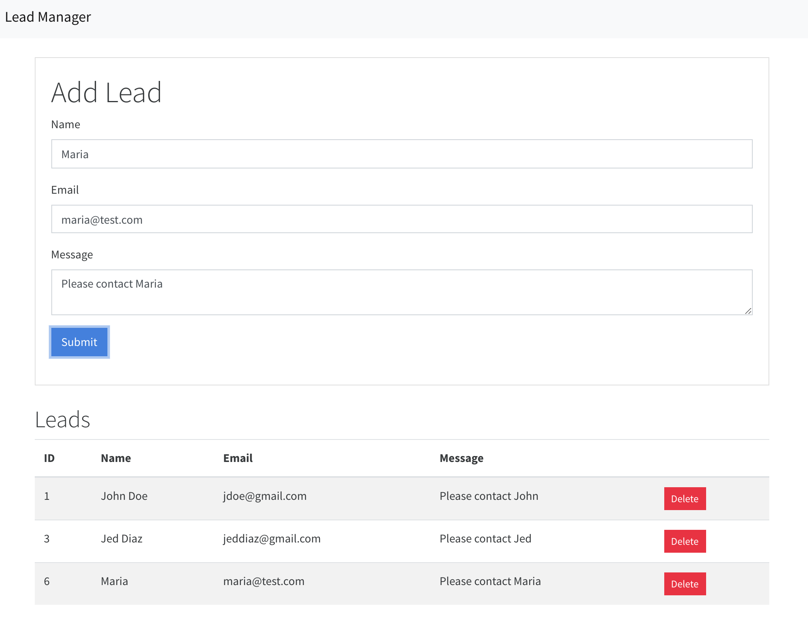

# react-leads

## What is this?

A Django app Restful API with the Django Rest Framework integrated with React Redux that is setup with Webpack & Babel.

## Features

- Python  
- Django  
- React Redux  
- Webpack & Babel

## Screen

## 💫 Links

[Django Rest Framework](https://www.django-rest-framework.org/)  
[Django and React together](https://www.valentinog.com/blog/tutorial-api-django-rest-react/#Django_REST_with_React_Django_and_React_together)  
[Setting up Django and React](http://v1k45.com/blog/modern-django-part-1-setting-up-django-and-react/)
